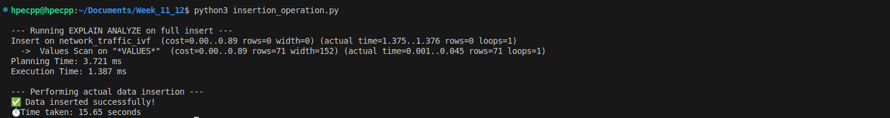
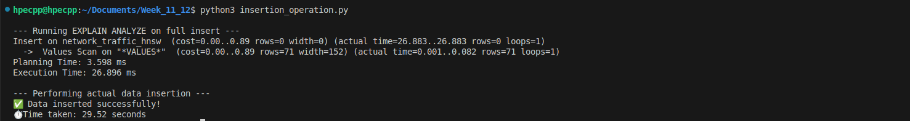
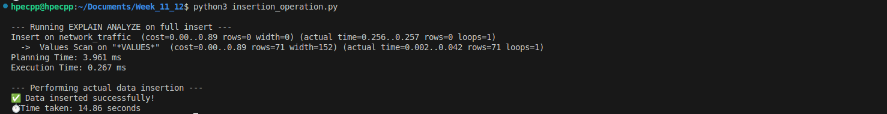
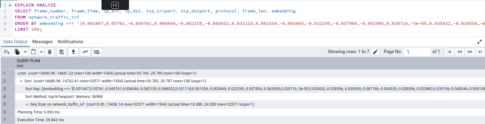
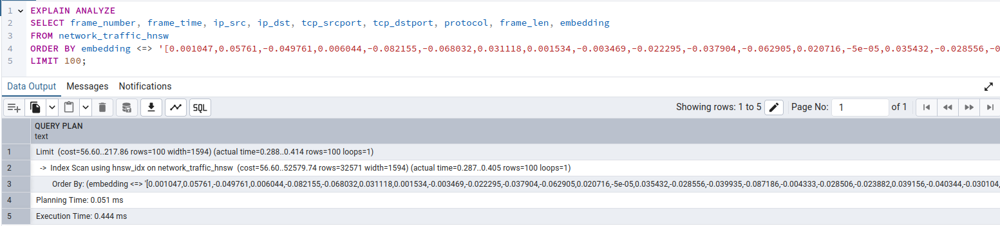
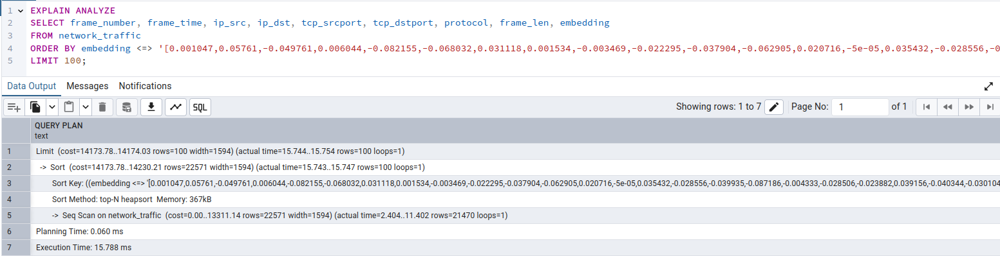
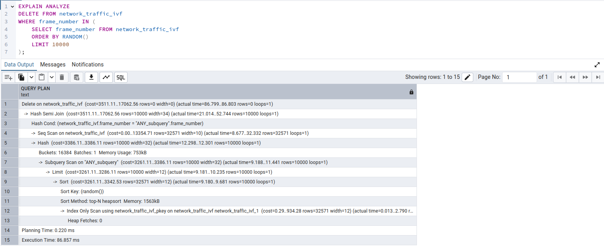
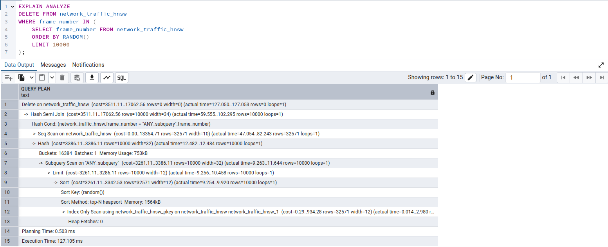
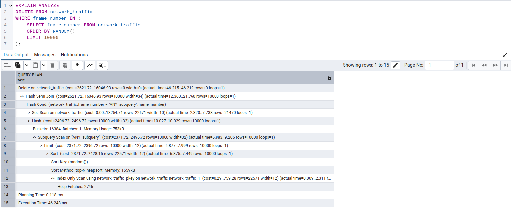

# Results of Latency Benchmarks – Pgvector Database

## Dataset: 32 K rows IP Flow

## Time Taken by different CRUD Operations

> **Formula**:  
> **Total Time = Planning Time + Execution Time**

| **Operation**             | **IVF**            | **HNSW**           | **Without Indexing**   |
|--------------------------|--------------------|--------------------|------------------------|
| **Create: Insertion**    |                    |                    |                        |
| • Planning Time          | 3.721 ms           | 3.598 ms           | 3.961 ms               |
| • Execution Time         | 1.387 ms            | 26.896 ms            | 0.267 ms                |
| **Read: Cosine Similarity** |                |                    |                        |
| • Planning Time          | 0.053 ms           | 0.051 ms           | 0.060 ms               |
| • Execution Time         | 29.842 ms             | 0.444 ms              | 15.788 ms                 |
| **Delete: Deletion of 10k records** |         |                    |                        |
| • Planning Time          | 0.220 ms           | 0.503 ms           | 0.118 ms               |
| • Execution Time         | 86.857 ms            | 127.105 ms            | 46.248 ms                |

---

## Screenshots of Results

### Insertion

### Cosine Similarity (Read)

### Deletion

