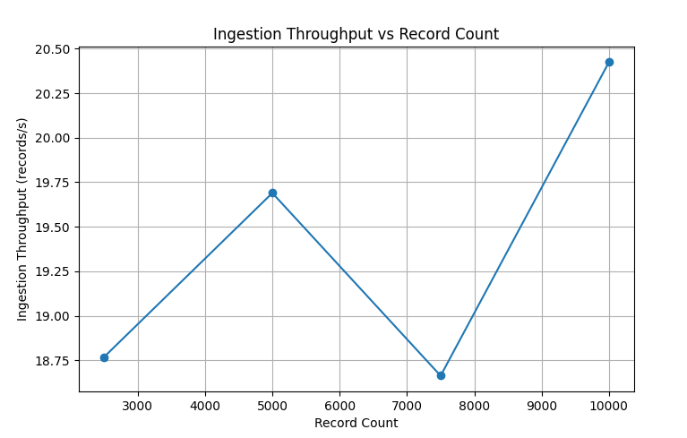
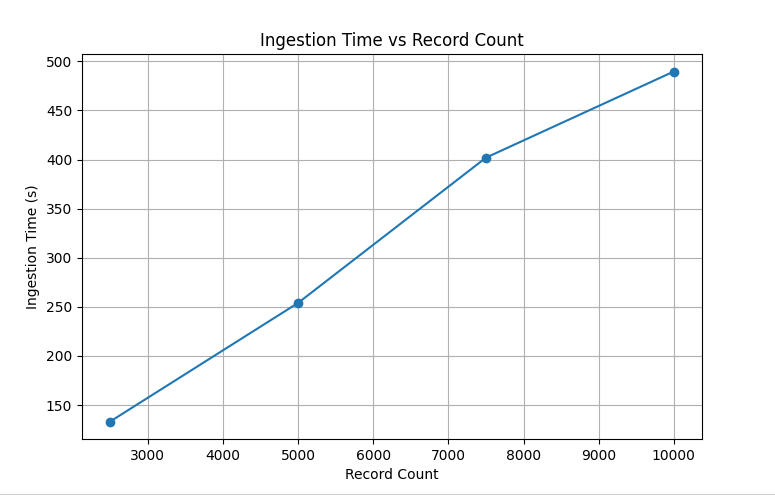
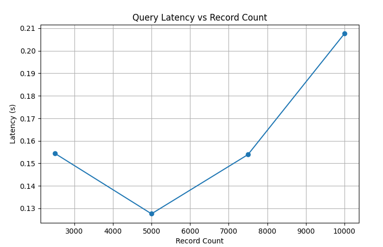
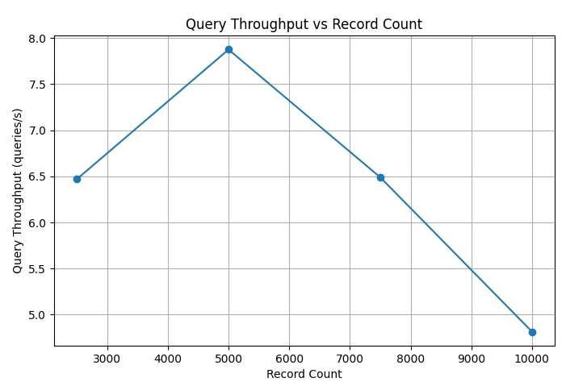
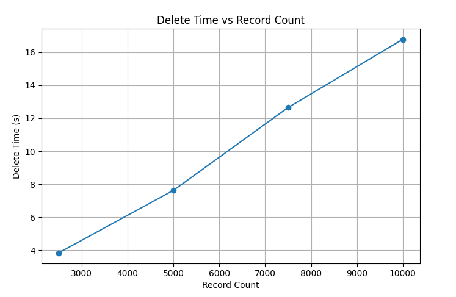
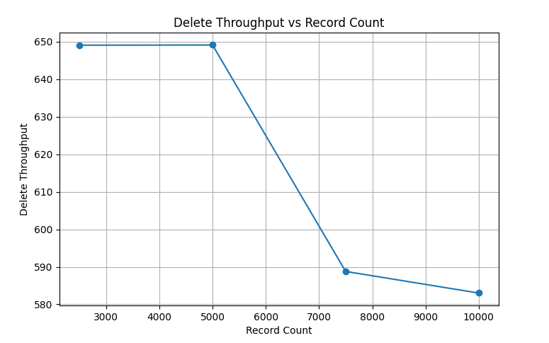
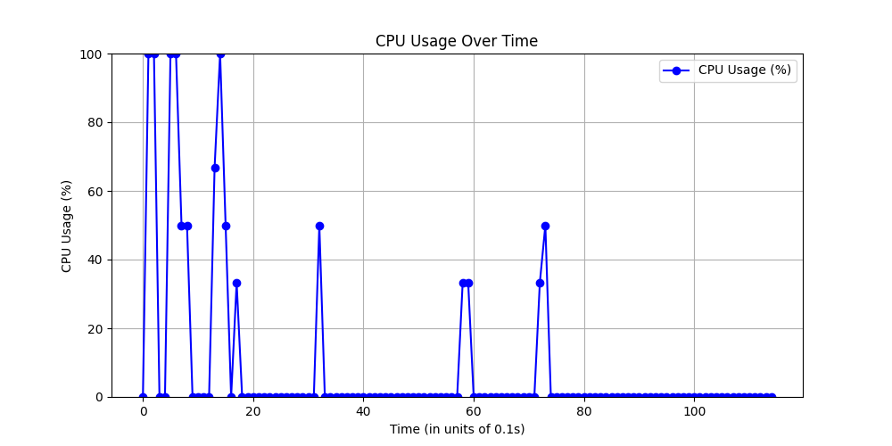
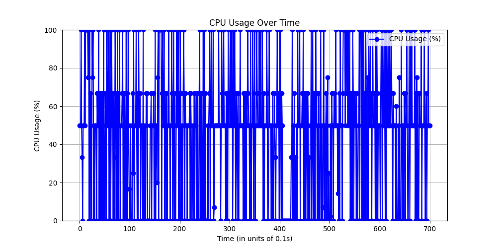

# Progress :

- Fixed the issue where updates were silently failing.
- Updated ingestion records to be stored in a sentential format. This led to a roughly 20% increase in semantic scores for the same queries.

---

## Benchmarked Metrics Tabulated (considering the all-MiniLM-L6-v2 model):

| Record Count | Indexing Method | Time Taken(s) | Throughput | Latency (s) | Query Throughput (queries/s) | Memory Usage (Delta) (MB) | Memory Percentage Change (%) | Distance | Similarity Score | Update Time Taken(s) | Records Updated | Update Throughput | Delete Time Taken(s) | Records Affected | Delete Throughput |
|--------------|------------------|----------------|------------|-------------|-------------------------------|----------------------------|-------------------------------|----------|------------------|-----------------------|------------------|--------------------|----------------------|--------------------|---------------------|
| 2500         | HNSW             | 133.2          | 18.76      | 0.1544      | 6.47                          | 24.5                       | 2                             | 0.4279   | 0.5721           | 5.67                  | 2499             | 440.7              | 3.85                 | 2499               | 649.09              |
| 5000         | HNSW             | 253.94         | 19.68      | 0.1276      | 7.8759                        | 24.12                      | 2                             | 0.406    | 0.594            | 12.19                 | 4953             | 406.31             | 7.63                 | 4953               | 649.14              |
| 7500         | HNSW             | 401.854        | 18.66      | 0.1539      | 6.49                          | 24.25                      | 2                             | 0.405    | 0.595            | 17.56                 | 7448             | 424.14             | 12.65                | 7448               | 588.77              |
| 10000        | HNSW             | 489.622        | 20.42      | 0.2076      | 4.8162                        | 24.12                      | 2                             | 0.3955   | 0.6044           | 31.36                 | 9783             | 311.95             | 16.78                | 9783               | 583.01              |

---

## Performance Visualizations

### Ingestion

- 
- 

### Query

- 
- 

### Update

- 
- 

### Delete

- 
- 

### CPU Usage
- **Ingestion**
  
- **Query Execution**
  
- **Update Operation**
  
- **Delete Operation**
  

---

## Observations

- Semantic queries seem to struggle to match numbers such as IP addresses with accuracy.
- They consistently perform well with text-related queries like "Find me records which use the HTTP protocol".
