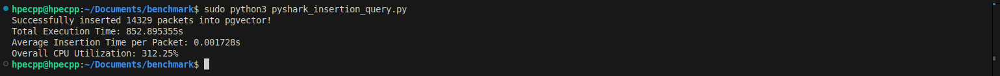
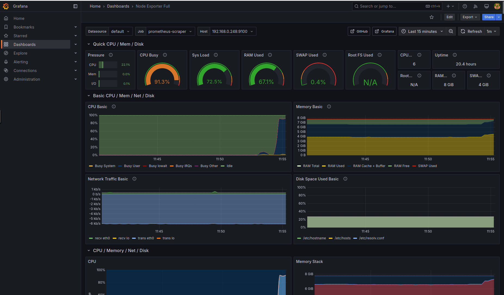
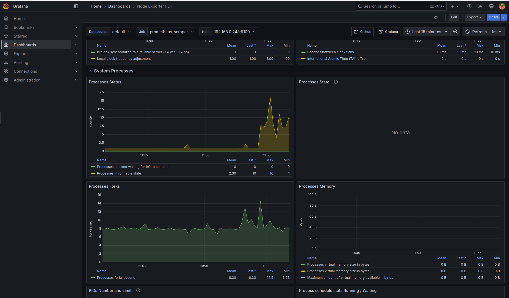
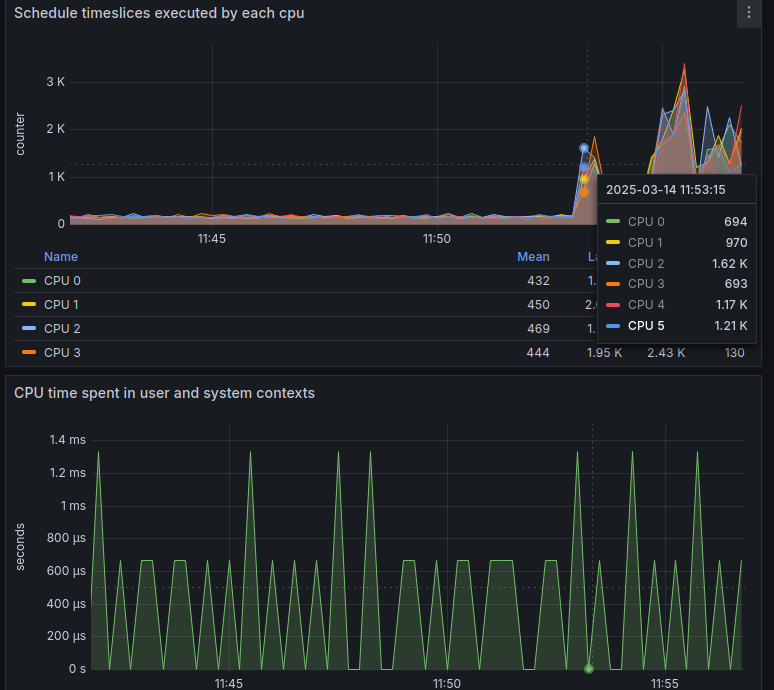
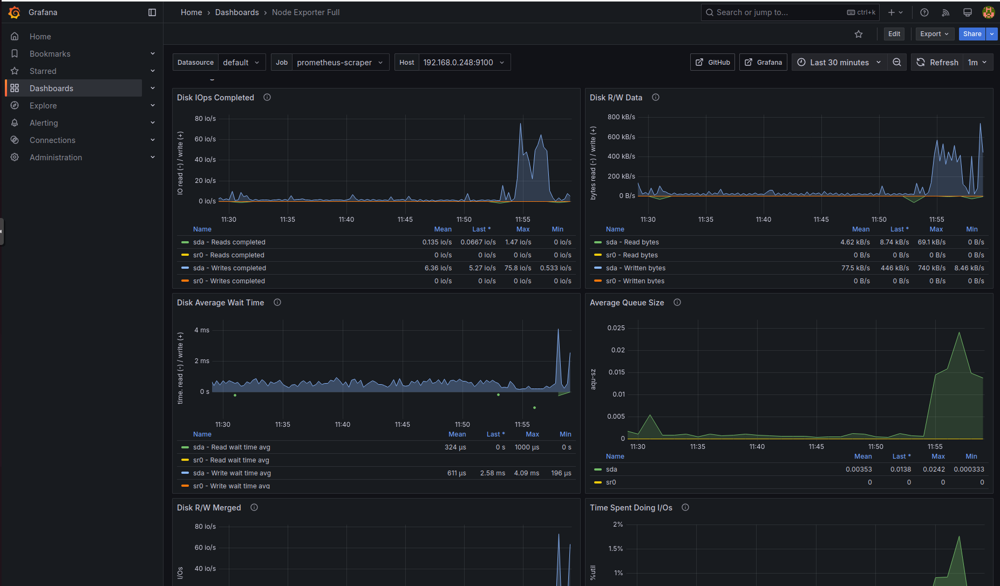
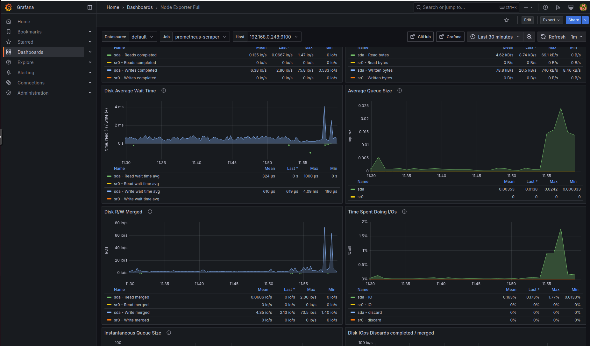
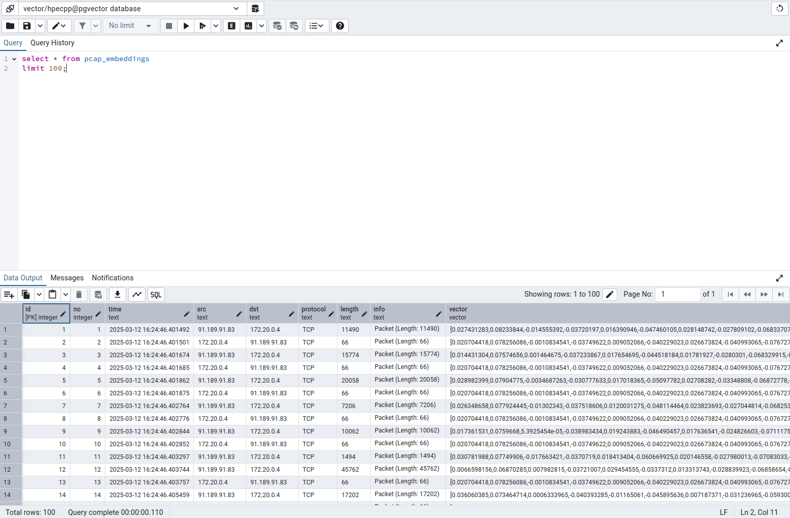
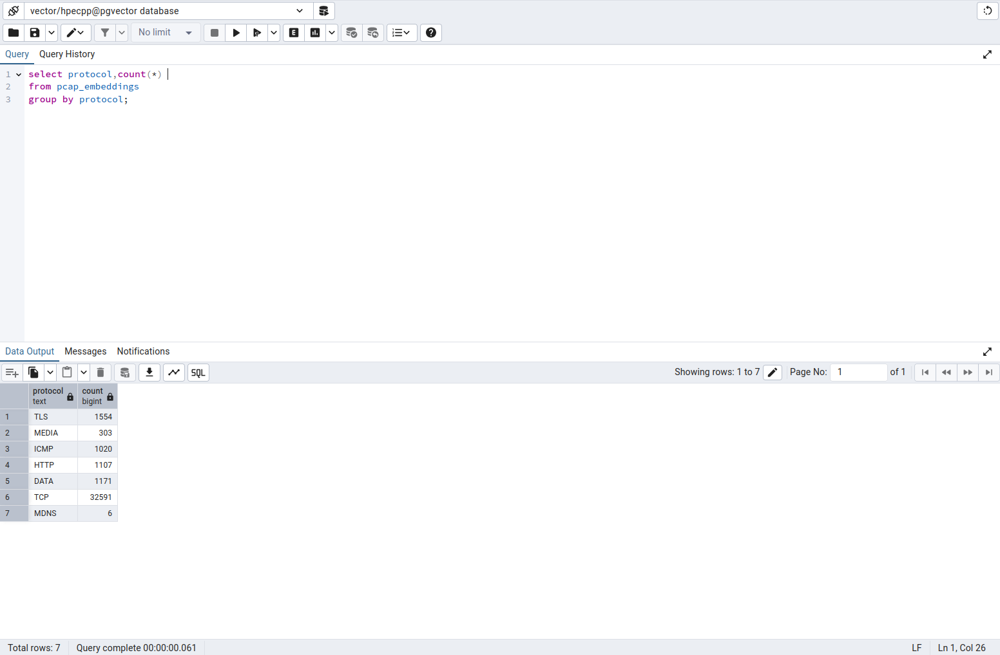

# Monitoring Pgvector Database using Prometheus and Grafana

##  Overview
Prometheus is a powerful open-source monitoring system that collects and stores time-series data. When benchmarking a pgvector database, Prometheus can be used to track key performance metrics such as query latency, CPU and memory usage, and disk I/O. It scrapes metrics from PostgreSQL exporters and provides real-time insights.

Grafana, a visualization tool, complements Prometheus by displaying these metrics in intuitive dashboards. It allows users to analyze trends, detect bottlenecks, and optimize database performance. By integrating Prometheus and Grafana, users can effectively monitor pgvector query efficiency and system resource utilization for benchmarking and optimization.

##  Screenshots

### Dashboard View
  
*Output of Python script that processes network packets from a .pcapng file, extracts features, and generates vector embeddings using SentenceTransformer (all-MiniLM-L6-v2). It inserts the data into a PostgreSQL database with pgvector. The script also measures execution time, insertion speed, and CPU usage using psutil for performance benchmarking of vectorized packet storage.*

### Overall Usage
  
*This image is grafana's node exporter dashboard containing overall Usage status.*

### Process Usage
  
*This image shows process utilization.*

### CPU Utilization
  
*This image shows CPU utilization per CPU and System Context Switches.*

### Disk Utilization
  
  
*These images shows disk IOps, read and write speeds, Average waiting time, etc.*

### Database Queries
  
*Image demonstrates the table columns and sample data stored in the table in pgvector database using select statement.*

  
*Image demonstrates number of rows stored per Protocol using group by clause sql query.*