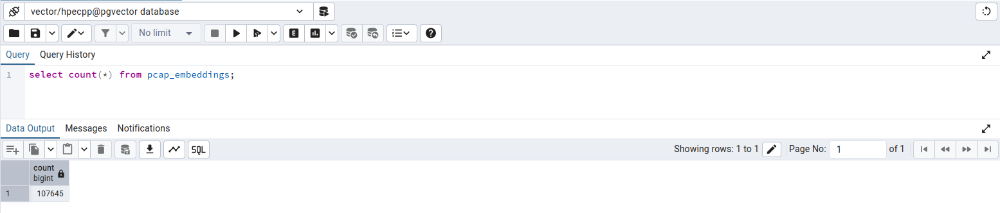
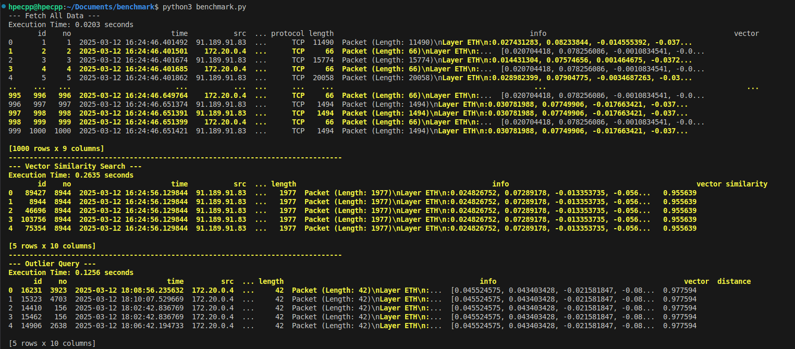
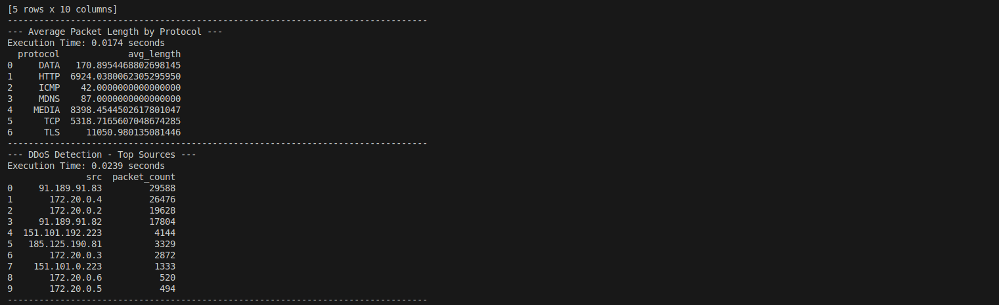
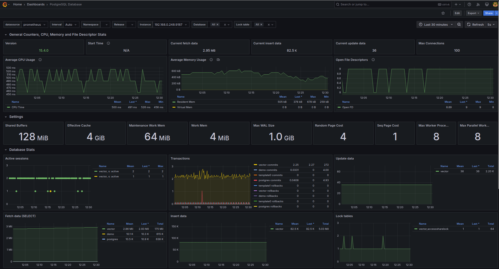
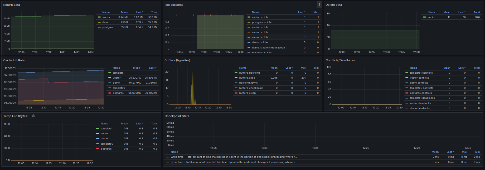

# Network Packet Data Benchmarking with pgvector

## Overview
This script benchmarks various queries on network packet data stored in PostgreSQL with the `pgvector` extension. It evaluates query performance and provides insights into network traffic using vector-based similarity searches, anomaly detection, and statistical aggregations.

## Features
- **Fetch Sample Data:** Retrieve a subset of packet embeddings.
- **Vector Similarity Search:** Find packets similar to a given vector.
- **Outlier Detection:** Identify packets with the largest distance from a reference vector.
- **Protocol Analysis:** Compute the average packet length per protocol.
- **DDoS Detection:** Identify potential attack sources by counting packet occurrences.

## Output of benchmark.py script

*Number of rows present before performing benchmark.* 
  
  

## Grafana Dashboard for Postgres Database 

After implementing the Prometheus and Grafana stack last week to visualize machine metrics using the Node Exporter dashboard, this week focused on setting up a dedicated dashboard to monitor PostgreSQL database-specific metrics.

