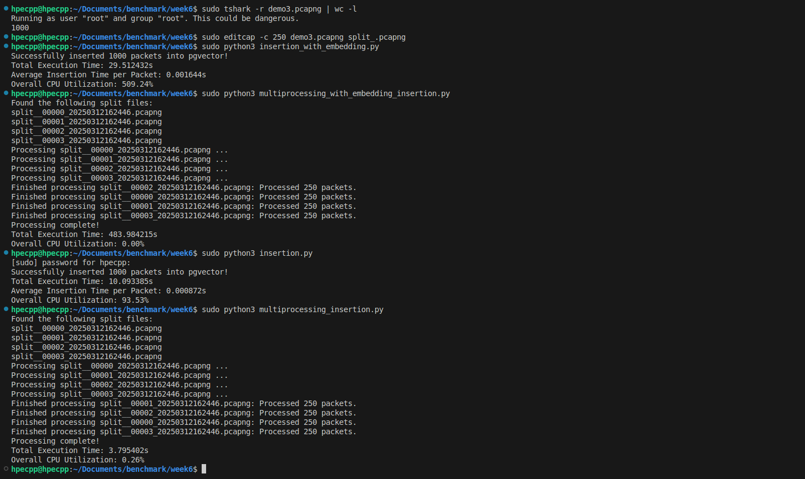

# Comparison between single and multi processing insertion capabilities of Pgvector

There are Four scripts for processing PCAP files with pyshark and inserting packet data along with vector embeddings into a PostgreSQL database (pgvector). Each script is designed for different scenarios, from single-process operations with dummy or real embeddings to multiprocessing versions that leverage multiple CPU cores. Detailed performance metrics, including execution time and CPU utilization via psutil, are recorded in every case. Update the database credentials and file paths as required before running these scripts.

---
## System Configuration
- 6 vCPU Virtual Machine 
- 8 GB RAM
- No Accelerated Computing Device (like GPU,TPU, etc)
---

## 1. Script: insertion.py - Utililizing Single Process without Embedding Model

This script reads a PCAPNG file using pyshark and extracts key packet details such as timestamp, source, destination, protocol, length, and a truncated packet info string. Instead of generating meaningful embeddings, it simulates the process by returning a constant dummy vector with 384 dimensions. The script then inserts both the packet metadata and the dummy vector into a PostgreSQL table configured with pgvector support. It also measures performance metrics like average insertion time per packet and overall CPU utilization using psutil.

---

## 2. Script: insertion_with_embedding.py - Utililizing Single Process with Embedding Model

This script processes a PCAPNG file using pyshark to extract relevant packet features including time, source, destination, protocol, length, and packet information. It employs the SentenceTransformer model ("all-MiniLM-L6-v2") to convert the extracted packet info into a meaningful 384-dimensional embedding. The resulting data and embedding vector are then inserted into a PostgreSQL table that supports pgvector storage. Additionally, the script captures performance metrics such as the average insertion time per packet and overall CPU utilization using psutil.

---

## 3. Script: multiprocessing_insertion.py - Utililizing Multiple Process without Embedding Model

This script extends the dummy embedding approach by utilizing Python’s multiprocessing to process multiple split PCAPNG files concurrently. It identifies files with “split” in their names via a shell command and then distributes the workload across multiple worker processes. Each process creates its own asyncio event loop and PostgreSQL connection to independently extract packet features and simulate embeddings using a constant 384-dimensional zero vector. The packet data along with the dummy embeddings are inserted into a PostgreSQL table supporting pgvector. Performance metrics, including overall execution time and CPU utilization, are recorded with psutil. This parallelized version significantly speeds up processing large datasets by leveraging available CPU cores.

---

## 4. Script: multiprocessing_with_embedding_insertion.py - Utililizing Multiple Process with Embedding Model

This script processes multiple split PCAPNG files concurrently using Python’s multiprocessing module, while employing a real embedding model. Initially, it retrieves file names containing “split” and then assigns each file to a separate worker process. Each process creates its own asyncio event loop and PostgreSQL connection. The script uses pyshark to extract packet features, and for each packet, the global SentenceTransformer model ("all-MiniLM-L6-v2") generates a 384-dimensional embedding from packet information. The packet metadata and corresponding embedding are inserted into a PostgreSQL table configured with pgvector. Overall performance metrics, including total execution time and CPU utilization, are captured via psutil, demonstrating the efficiency of parallel processing is a challenge in a non Accelerated Computing machine as the process switching for embedding model made the entire insertion time much worse than single process insertion.

## Output of benchmark.py script

### Comparison between Insertion of 14k Packets without Embedding Model in Single vs Multiple Process
  
*A single Pcap file was processed by single process executing in single core* 
 
*Pcap file was split into multiple pcap file (Here 4 files as 4 processes were created) demonstrating speedup in insertion.* 

### Comparison between all the scripts with dataset containing 258 Packets  

### Comparison between all the scripts with dataset containing 1000 Packets 
  

*Comparison between all the scripts with dataset containing 258 Packets and 1000 packets for single proceess given single file and multiple process with multiple files and executed by 4 worker process. Observation is that if embedding model is considered multiple process will not work as expected efficiency because of innvolvement embedding computational overheads and in limited resource machine * 

