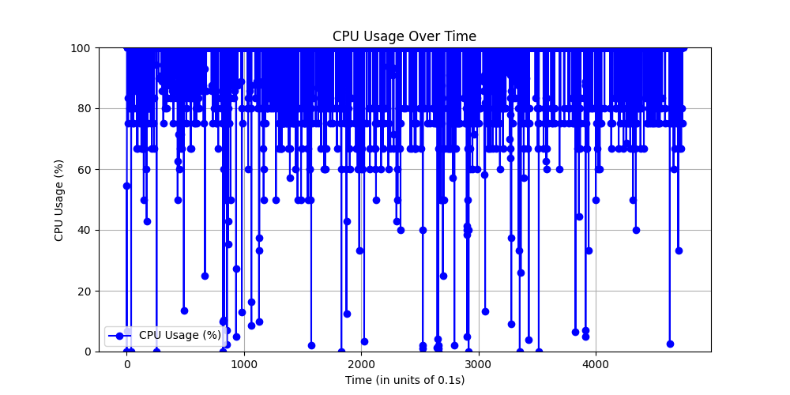

## Progress

### Updated Schema to Use 5-Tuple IP Flows

The schema format is now updated to capture the following fields:

- `Frame_Number`
- `Frame_Time`
- `Source_IP`
- `Destination_IP`
- `Source_Port`
- `Destination_Port`
- `Protocol`
- `Frame_Length` / `Packet_Size`

---

### Implemented ACORN Strategy for HNSW

ACORN (Accelerated Combined Retrieval Optimization Network) was implemented with HNSW indexing, but **no noticeable performance improvement** was observed.

Based on the documentation, the reason is:

> **ACORN is only relevant for hybrid/vector queries.**  
> It optimizes query performance when both a semantic/vector query and a structured filter are used together, such as:  
> - `.with_near_text(...)` (vector-based)  
> - `.with_where(...)` (filter-based)

---

### Flat Indexing in Weaviate — Insights from Documentation

- **Drawback**: Flat index does **not scale well** to large datasets.
- **Reason**: It has **linear time complexity** as the number of objects grows.
- In contrast, **HNSW indexing offers logarithmic complexity**, making it far more efficient for large-scale datasets.

---

### CPU Usage Monitoring

Modified ingestion, update, and deletion operations to **track CPU usage** using a **daemon thread** monitoring the currently running process.

---

## Benchmark Metrics

| Model              | Record Count | Indexing Method | Ingestion Time | Ingestion Throughput | Query Metrics | Latency (s) | Throughput | Mem Usage Δ (MB) | Mem Δ (%) | Distance | Similarity | Update Time (s) | Records Updated | Update Throughput | Delete Time (s) | Records Deleted | Delete Throughput |
|--------------------|--------------|------------------|----------------|----------------|------------------|-------------|------------|-------------------|------------|----------|-------------|------------------|------------------|-------------------|------------------|------------------|-------------------|
| all-MiniLM-L6-v2   | 10,000       | HNSW             | 581.223        | 17.2051        | -                | 0.1357      | 7.3668     | 24.44             | 2          | 0.5373   | 0.4627      | 12.1             | 9781             | 808.35            | 0.3784           | 217              | 573.47            |
|                    |              |                  |                |                |                  |             |            |                   |            | 0.5384   | 0.4616      |                  |                  |                   |                  |                  |                   |
|                    |              |                  |                |                |                  |             |            |                   |            | 0.5386   | 0.4614      |                  |                  |                   |                  |                  |                   |
|                    |              |                  |                |                |                  |             |            |                   |            | 0.5399   | 0.4601      |                  |                  |                   |                  |                  |                   |
|                    |              |                  |                |                |                  |             |            |                   |            | 0.5403   | 0.4597      |                  |                  |                   |                  |                  |                   |
|                    |              |                  |                |                |                  |             |            |                   |            | 0.5103   | 0.4897      |                  |                  |                   |                  |                  |                   |
|                    |              |                  |                |                |                  |             |            |                   |            | 0.5112   | 0.4888      |                  |                  |                   |                  |                  |                   |
|                    |              |                  |                |                |                  |             |            |                   |            | 0.5120   | 0.4880      |                  |                  |                   |                  |                  |                   |
|                    |              |                  |                |                |                  |             |            |                   |            | 0.5131   | 0.4869      |                  |                  |                   |                  |                  |                   |
|                    |              |                  |                |                |                  |             |            |                   |            | 0.5135   | 0.4865      |                  |                  |                   |                  |                  |                   |
| all-MiniLM-L6-v2   | 10,000       | Flat             | 549.97         | 18.1828        | -                | 0.1374      | 7.2785     | 22.88             | 2          | 0.5373   | 0.4627      | -                | -                | -                 | 0.2426           | 217              | 894.48            |
|                    |              |                  |                |                |                  |             |            |                   |            | 0.5384   | 0.4616      |                  |                  |                   |                  |                  |                   |
|                    |              |                  |                |                |                  |             |            |                   |            | 0.5386   | 0.4614      |                  |                  |                   |                  |                  |                   |
|                    |              |                  |                |                |                  |             |            |                   |            | 0.5399   | 0.4601      |                  |                  |                   |                  |                  |                   |
|                    |              |                  |                |                |                  |             |            |                   |            | 0.5403   | 0.4597      |                  |                  |                   |                  |                  |                   |
|                    |              |                  |                |                |                  |             |            |                   |            | 0.4723   | 0.5277      |                  |                  |                   |                  |                  |                   |
|                    |              |                  |                |                |                  |             |            |                   |            | 0.5102   | 0.4898      |                  |                  |                   |                  |                  |                   |
|                    |              |                  |                |                |                  |             |            |                   |            | 0.5103   | 0.4897      |                  |                  |                   |                  |                  |                   |
|                    |              |                  |                |                |                  |             |            |                   |            | 0.5112   | 0.4888      |                  |                  |                   |                  |                  |                   |
|                    |              |                  |                |                |                  |             |            |                   |            | 0.5120   | 0.4880      |                  |                  |                   |                  |                  |                   |

---

##  CPU Usage Snapshots

Visual comparisons of CPU usage for different operations. All images are located in `./screenshots`.

- **Ingestion**
  

- **Query Execution**
  

- **Update Operation**
  

- **Delete Operation**
  

---

## Notes on Semantic Querying

- Semantic queries sometimes give **incorrect results**, especially with **Flat Indexing**.
- Likely cause: Sentence transformer-based tokenization **is not optimal for IP flow data**.
- This also affects **Update operations**, which fail when semantic queries do not return valid results. As seen in the table above I have not been able to record update metrics thus.

---

